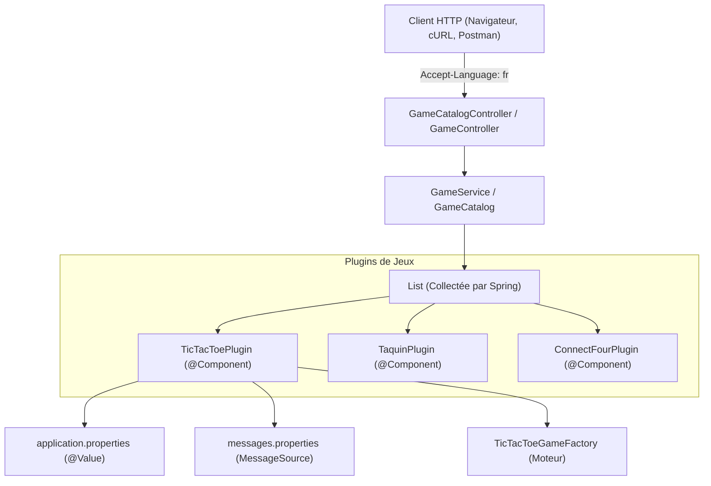

# 📘 Guide Pas à Pas — Implémentation de l'Itération 2.4 (Plugins, @Value & i18n)

> **Objectif pédagogique** :  
> Enrichir notre API pour qu'elle gère des **valeurs par défaut configurables** (via `application.properties`) et des **noms de jeux traduits** (via `MessageSource` et l'en-tête HTTP `Accept-Language`), en introduisant le patron de conception **Plugin**.

---

## 🧭 Vue d'ensemble de l'architecture cible

Actuellement, `GameServiceImpl` appelle directement les `GameFactory` du moteur externe. Or, ce moteur ne connaît ni les langues humaines, ni les valeurs par défaut de notre application.

Nous allons insérer une couche intermédiaire de **Plugins** :



---

## 📋 Sommaire des étapes

1. [Étape 1 : Créer l'interface `GamePlugin`](#étape-1--créer-linterface-gameplugin)
2. [Étape 2 : Externaliser les valeurs par défaut (`application.properties`)](#étape-2--externaliser-les-valeurs-par-défaut-applicationproperties)
3. [Étape 3 : Créer les fichiers de traduction (`messages.properties`)](#étape-3--créer-les-fichiers-de-traduction-messagesproperties)
4. [Étape 4 : Implémenter les trois Plugins (`@Component`)](#étape-4--implémenter-les-trois-plugins-component)
5. [Étape 5 : Refactorer `GameServiceImpl` pour consommer `List<GamePlugin>`](#étape-5--refactorer-gameserviceimpl-pour-consommer-listgameplugin)
6. [Étape 6 : Adapter `GameCatalog` et `GameCatalogController` pour le multilingue](#étape-6--adapter-gamecatalog-et-gamecatalogcontroller-pour-le-multilingue)
7. [Étape 7 : Tester et valider (cURL & Tests automatisés)](#étape-7--tester-et-valider-curl--tests-automatisés)

---

## Étape 1 : Créer l'interface `GamePlugin`

### 🎯 Rôle
L'interface `GamePlugin` définit le contrat de chaque plugin de jeu :
- Fournir l'identifiant technique du jeu (`getFactoryId()`).
- Fournir son nom affichable et traduit selon la langue (`getName(Locale locale)`).
- Fournir ses valeurs par défaut (nombre de joueurs, taille de plateau).
- Créer une partie en appliquant automatiquement les valeurs par défaut si les paramètres sont absents ou incomplets.

### 📝 Fichier à créer
📁 `src/main/java/com/bsourichanh/javaspring/plugin/GamePlugin.java`

```java
package com.bsourichanh.javaspring.plugin;

import fr.le_campus_numerique.square_games.engine.Game;
import java.util.Locale;

public interface GamePlugin {

    /** Identifiant technique du moteur (ex: "tictactoe", "15 puzzle", "connect4") */
    String getFactoryId();

    /** Nom traduit du jeu selon la langue demandée (ex: "Morpion" en FR, "Tic-Tac-Toe" en EN) */
    String getName(Locale locale);

    /** Nombre de joueurs par défaut */
    int getDefaultPlayerCount();

    /** Taille du plateau par défaut */
    int getDefaultBoardSize();

    /**
     * Crée une nouvelle partie.
     * Si playerCount ou boardSize est null ou <= 0, utilise la valeur par défaut configurée.
     */
    Game createGame(Integer playerCount, Integer boardSize);
}
```

---

## Étape 2 : Externaliser les valeurs par défaut (`application.properties`)

### 🎯 Rôle
Permettre de modifier les règles par défaut (ex: taille du plateau ou nombre de joueurs) sans jamais recompiler le code Java, simplement en modifiant ce fichier de configuration.

### 📝 Fichier à modifier
📁 `src/main/resources/application.properties`

Ajoutez le bloc suivant :

```properties
spring.application.name=JavaSpring

# ==============================================================================
# Configuration des valeurs par défaut des jeux (Square Games)
# ==============================================================================
# Tic-Tac-Toe (Morpion) : 2 joueurs, plateau 3x3
game.tictactoe.default-player-count=2
game.tictactoe.default-board-size=3

# Taquin (15 puzzle) : 1 joueur (jeu solo), plateau 4x4
game.taquin.default-player-count=1
game.taquin.default-board-size=4

# Puissance 4 (Connect Four) : 2 joueurs, plateau 7x7
game.connectfour.default-player-count=2
game.connectfour.default-board-size=7
```

---

## Étape 3 : Créer les fichiers de traduction (`messages.properties`)

### 🎯 Rôle
Spring Boot intègre nativement l'interface `MessageSource`. Lorsque des fichiers nommés `messages.properties`, `messages_fr.properties`, etc. sont placés dans `src/main/resources`, Spring sait automatiquement charger la bonne chaîne selon la `Locale` (langue demandée par le client HTTP).

### 📝 1. Fichier par défaut (Anglais)
📁 `src/main/resources/messages.properties`

```properties
game.tictactoe.name=Tic-Tac-Toe
game.taquin.name=15 Puzzle (Taquin)
game.connectfour.name=Connect Four
```

### 📝 2. Fichier en Français
📁 `src/main/resources/messages_fr.properties`

```properties
game.tictactoe.name=Morpion
game.taquin.name=Taquin
game.connectfour.name=Puissance 4
```

---

## Étape 4 : Implémenter les trois Plugins (`@Component`)

Chaque plugin :
1. Est annoté `@Component` pour que Spring le détecte automatiquement.
2. Injecte ses propriétés externalisées avec `@Value("${propriete:valeurParDefaut}")`.
3. Injecte `MessageSource` pour traduire son nom via `messageSource.getMessage(...)`.
4. Injecte sa `GameFactory` pour instancier le jeu.

### 📝 1. `TicTacToePlugin.java`
📁 `src/main/java/com/bsourichanh/javaspring/plugin/TicTacToePlugin.java`

```java
package com.bsourichanh.javaspring.plugin;

import fr.le_campus_numerique.square_games.engine.Game;
import fr.le_campus_numerique.square_games.engine.tictactoe.TicTacToeGameFactory;
import org.springframework.beans.factory.annotation.Value;
import org.springframework.context.MessageSource;
import org.springframework.stereotype.Component;

import java.util.Locale;

@Component
public class TicTacToePlugin implements GamePlugin {

    private final TicTacToeGameFactory factory;
    private final MessageSource messageSource;
    private final int defaultPlayerCount;
    private final int defaultBoardSize;

    public TicTacToePlugin(
            TicTacToeGameFactory factory,
            MessageSource messageSource,
            @Value("${game.tictactoe.default-player-count:2}") int defaultPlayerCount,
            @Value("${game.tictactoe.default-board-size:3}") int defaultBoardSize
    ) {
        this.factory = factory;
        this.messageSource = messageSource;
        this.defaultPlayerCount = defaultPlayerCount;
        this.defaultBoardSize = defaultBoardSize;
    }

    @Override
    public String getFactoryId() {
        return factory.getGameFactoryId(); // "tictactoe"
    }

    @Override
    public String getName(Locale locale) {
        return messageSource.getMessage("game.tictactoe.name", null, locale);
    }

    @Override
    public int getDefaultPlayerCount() {
        return defaultPlayerCount;
    }

    @Override
    public int getDefaultBoardSize() {
        return defaultBoardSize;
    }

    @Override
    public Game createGame(Integer playerCount, Integer boardSize) {
        int players = (playerCount != null && playerCount > 0) ? playerCount : defaultPlayerCount;
        int size = (boardSize != null && boardSize > 0) ? boardSize : defaultBoardSize;
        return factory.createGame(players, size);
    }
}
```

### 📝 2. `TaquinPlugin.java`
📁 `src/main/java/com/bsourichanh/javaspring/plugin/TaquinPlugin.java`

```java
package com.bsourichanh.javaspring.plugin;

import fr.le_campus_numerique.square_games.engine.Game;
import fr.le_campus_numerique.square_games.engine.taquin.TaquinGameFactory;
import org.springframework.beans.factory.annotation.Value;
import org.springframework.context.MessageSource;
import org.springframework.stereotype.Component;

import java.util.Locale;

@Component
public class TaquinPlugin implements GamePlugin {

    private final TaquinGameFactory factory;
    private final MessageSource messageSource;
    private final int defaultPlayerCount;
    private final int defaultBoardSize;

    public TaquinPlugin(
            TaquinGameFactory factory,
            MessageSource messageSource,
            @Value("${game.taquin.default-player-count:1}") int defaultPlayerCount,
            @Value("${game.taquin.default-board-size:4}") int defaultBoardSize
    ) {
        this.factory = factory;
        this.messageSource = messageSource;
        this.defaultPlayerCount = defaultPlayerCount;
        this.defaultBoardSize = defaultBoardSize;
    }

    @Override
    public String getFactoryId() {
        return factory.getGameFactoryId(); // "15 puzzle"
    }

    @Override
    public String getName(Locale locale) {
        return messageSource.getMessage("game.taquin.name", null, locale);
    }

    @Override
    public int getDefaultPlayerCount() {
        return defaultPlayerCount;
    }

    @Override
    public int getDefaultBoardSize() {
        return defaultBoardSize;
    }

    @Override
    public Game createGame(Integer playerCount, Integer boardSize) {
        int players = (playerCount != null && playerCount > 0) ? playerCount : defaultPlayerCount;
        int size = (boardSize != null && boardSize > 0) ? boardSize : defaultBoardSize;
        return factory.createGame(players, size);
    }
}
```

### 📝 3. `ConnectFourPlugin.java`
📁 `src/main/java/com/bsourichanh/javaspring/plugin/ConnectFourPlugin.java`

```java
package com.bsourichanh.javaspring.plugin;

import fr.le_campus_numerique.square_games.engine.Game;
import fr.le_campus_numerique.square_games.engine.connectfour.ConnectFourGameFactory;
import org.springframework.beans.factory.annotation.Value;
import org.springframework.context.MessageSource;
import org.springframework.stereotype.Component;

import java.util.Locale;

@Component
public class ConnectFourPlugin implements GamePlugin {

    private final ConnectFourGameFactory factory;
    private final MessageSource messageSource;
    private final int defaultPlayerCount;
    private final int defaultBoardSize;

    public ConnectFourPlugin(
            ConnectFourGameFactory factory,
            MessageSource messageSource,
            @Value("${game.connectfour.default-player-count:2}") int defaultPlayerCount,
            @Value("${game.connectfour.default-board-size:7}") int defaultBoardSize
    ) {
        this.factory = factory;
        this.messageSource = messageSource;
        this.defaultPlayerCount = defaultPlayerCount;
        this.defaultBoardSize = defaultBoardSize;
    }

    @Override
    public String getFactoryId() {
        return factory.getGameFactoryId(); // "connect4"
    }

    @Override
    public String getName(Locale locale) {
        return messageSource.getMessage("game.connectfour.name", null, locale);
    }

    @Override
    public int getDefaultPlayerCount() {
        return defaultPlayerCount;
    }

    @Override
    public int getDefaultBoardSize() {
        return defaultBoardSize;
    }

    @Override
    public Game createGame(Integer playerCount, Integer boardSize) {
        int players = (playerCount != null && playerCount > 0) ? playerCount : defaultPlayerCount;
        int size = (boardSize != null && boardSize > 0) ? boardSize : defaultBoardSize;
        return factory.createGame(players, size);
    }
}
```

---

## Étape 5 : Refactorer `GameServiceImpl` pour consommer `List<GamePlugin>`

### 🎯 Rôle
Au lieu de manipuler directement les `GameFactory`, `GameServiceImpl` injecte `List<GamePlugin>`. Spring regroupe automatiquement tous les `@Component` implémentant `GamePlugin`.

### 📝 Fichier à modifier
📁 `src/main/java/com/bsourichanh/javaspring/service/GameServiceImpl.java`

```java
package com.bsourichanh.javaspring.service;

import com.bsourichanh.javaspring.dto.GameCreationParams;
import com.bsourichanh.javaspring.plugin.GamePlugin;
import fr.le_campus_numerique.square_games.engine.Game;
import org.springframework.stereotype.Service;

import java.util.List;
import java.util.Map;
import java.util.UUID;
import java.util.concurrent.ConcurrentHashMap;

@Service
public class GameServiceImpl implements GameService {

    private final List<GamePlugin> plugins;
    private final Map<UUID, Game> games = new ConcurrentHashMap<>();

    // Spring injecte automatiquement la liste de tous les beans GamePlugin
    public GameServiceImpl(List<GamePlugin> plugins) {
        this.plugins = plugins;
    }

    @Override
    public Game createGame(GameCreationParams params) {
        GamePlugin plugin = getPluginForType(params.gameType());
        // Utilise les valeurs par défaut si non fournies
        Game game = plugin.createGame(params.playerCount(), params.boardSize());
        games.put(game.getId(), game);
        return game;
    }

    @Override
    public Game getGame(UUID gameId) {
        return games.get(gameId);
    }

    private GamePlugin getPluginForType(String type) {
        if (type == null || type.isBlank()) {
            type = "tictactoe";
        }
        String normalized = type.toLowerCase().trim();
        for (GamePlugin plugin : plugins) {
            String id = plugin.getFactoryId().toLowerCase();
            if (id.equals(normalized)
                    || (normalized.contains("tic") && id.contains("tictac"))
                    || (normalized.contains("taquin") && id.contains("puzzle"))
                    || (normalized.contains("connect") && id.contains("connect"))) {
                return plugin;
            }
        }
        throw new IllegalArgumentException("Type de jeu non supporté : " + type);
    }
}
```

---

## Étape 6 : Adapter `GameCatalog` et `GameCatalogController` pour le multilingue

### 🎯 Rôle
Faire en sorte que l'appel `GET /api/catalog/games` renvoie les informations des jeux (ou leurs libellés traduits) selon la langue demandée dans l'en-tête HTTP `Accept-Language` (ex: `Accept-Language: fr` ou `Accept-Language: en`).

### 📝 1. Créer un DTO pour la description d'un jeu
📁 `src/main/java/com/bsourichanh/javaspring/dto/GameDescriptionDto.java`

```java
package com.bsourichanh.javaspring.dto;

public record GameDescriptionDto(
        String id,
        String name,
        int defaultPlayerCount,
        int defaultBoardSize
) {}
```

### 📝 2. Mettre à jour `GameCatalog.java`
📁 `src/main/java/com/bsourichanh/javaspring/service/GameCatalog.java`

```java
package com.bsourichanh.javaspring.service;

import com.bsourichanh.javaspring.dto.GameDescriptionDto;
import java.util.Collection;
import java.util.Locale;

public interface GameCatalog {
    Collection<String> getAvailableGames();
    Collection<GameDescriptionDto> getAvailableGameDescriptions(Locale locale);
}
```

### 📝 3. Mettre à jour `GameCatalogImpl.java`
📁 `src/main/java/com/bsourichanh/javaspring/service/GameCatalogImpl.java`

```java
package com.bsourichanh.javaspring.service;

import com.bsourichanh.javaspring.dto.GameDescriptionDto;
import com.bsourichanh.javaspring.plugin.GamePlugin;
import org.springframework.stereotype.Service;

import java.util.Collection;
import java.util.List;
import java.util.Locale;

@Service
public class GameCatalogImpl implements GameCatalog {

    private final List<GamePlugin> plugins;

    public GameCatalogImpl(List<GamePlugin> plugins) {
        this.plugins = plugins;
    }

    @Override
    public Collection<String> getAvailableGames() {
        return plugins.stream()
                .map(GamePlugin::getFactoryId)
                .toList();
    }

    @Override
    public Collection<GameDescriptionDto> getAvailableGameDescriptions(Locale locale) {
        return plugins.stream()
                .map(plugin -> new GameDescriptionDto(
                        plugin.getFactoryId(),
                        plugin.getName(locale),
                        plugin.getDefaultPlayerCount(),
                        plugin.getDefaultBoardSize()
                ))
                .toList();
    }
}
```

### 📝 4. Mettre à jour `GameCatalogController.java`
📁 `src/main/java/com/bsourichanh/javaspring/controller/GameCatalogController.java`

Spring injecte automatiquement la `Locale` résolue depuis l'entête HTTP `Accept-Language` si on l'ajoute comme paramètre de méthode :

```java
package com.bsourichanh.javaspring.controller;

import com.bsourichanh.javaspring.dto.GameDescriptionDto;
import com.bsourichanh.javaspring.service.GameCatalog;
import org.springframework.web.bind.annotation.GetMapping;
import org.springframework.web.bind.annotation.RequestMapping;
import org.springframework.web.bind.annotation.RestController;

import java.util.Collection;
import java.util.Locale;

@RestController
@RequestMapping("/api/catalog")
public class GameCatalogController {

    private final GameCatalog gameCatalog;

    public GameCatalogController(GameCatalog gameCatalog) {
        this.gameCatalog = gameCatalog;
    }

    // Retourne la liste simple des identifiants (rétro-compatible)
    @GetMapping("/games")
    public Collection<String> listAvailableGames() {
        return gameCatalog.getAvailableGames();
    }

    // Retourne les jeux avec leurs libellés traduits selon l'entête HTTP Accept-Language
    @GetMapping("/games/detailed")
    public Collection<GameDescriptionDto> listDetailedGames(Locale locale) {
        return gameCatalog.getAvailableGameDescriptions(locale);
    }
}
```

---

## Étape 7 : Tester et valider (cURL & Tests automatisés)

### 1. Compiler et lancer les tests
```bash
./mvnw clean test
```

### 2. Démarrer le serveur
```bash
./mvnw spring-boot:run
```

### 3. Tester l'internationalisation avec cURL
```bash
# En Français :
curl -X GET http://localhost:8080/api/catalog/games/detailed -H "Accept-Language: fr"
# Résultat attendu : "Morpion", "Taquin", "Puissance 4"

# En Anglais :
curl -X GET http://localhost:8080/api/catalog/games/detailed -H "Accept-Language: en"
# Résultat attendu : "Tic-Tac-Toe", "15 Puzzle (Taquin)", "Connect Four"
```

### 4. Tester la création avec valeurs par défaut
Envoyez une requête où `playerCount` et `boardSize` sont omis ou à 0 :
```bash
curl -X POST http://localhost:8080/games \
  -H "Content-Type: application/json" \
  -d '{"gameType": "tictactoe"}'
```
👉 Le plugin Tic-Tac-Toe appliquera automatiquement `playerCount=2` et `boardSize=3` depuis `application.properties` !
