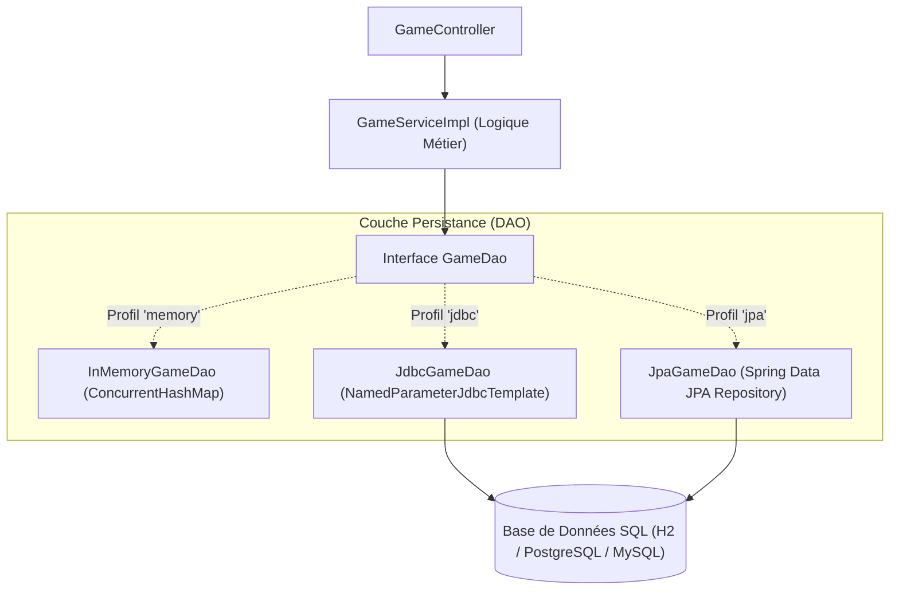

# 📘 Guide Pas à Pas — Implémentation de l'Itération 3 (Persistance & Pattern DAO)

> **Objectif pédagogique** :  
> Découpler l'application de tout stockage "en dur" dans le service en introduisant le patron de conception **DAO (Data Access Object)**.  
> Nous évoluerons de manière progressive :
> 1. Définition du contrat `GameDao`
> 2. Implémentation en mémoire (`InMemoryGameDao`)
> 3. Implémentation relationnelle en SQL direct via JDBC (`JdbcGameDao`)
> 4. Implémentation ORM via Spring Data JPA (`JpaGameDao`)
> 5. Gestion des profils Spring pour basculer facilement entre les modes de persistance

---

## 🧭 Vue d'ensemble de l'architecture

Actuellement, `GameServiceImpl` stocke les parties dans une variable locale `Map<UUID, Game> games`. Si le serveur redémarre, toutes les parties sont perdues, et la couche Service mélange logique métier et stockage.

Avec la couche **DAO** :



---

## 📋 Sommaire des Étapes

| Étape | Titre | Description |
| :---: | :--- | :--- |
| **3.1** | **Contrat DAO (`GameDao`)** | Création de l'interface `GameDao` définissant les opérations CRUD |
| **3.2** | **DAO en mémoire (`InMemoryGameDao`)** | Migration du stockage depuis `GameServiceImpl` vers `InMemoryGameDao` |
| **3.3** | **DAO avec JDBC (`JdbcGameDao`)** | Ajout de `spring-boot-starter-jdbc`, script SQL `schema.sql` et `NamedParameterJdbcTemplate` |
| **3.4** | **DAO avec JPA (`JpaGameDao`)** | Ajout de `spring-boot-starter-data-jpa`, entités `@Entity` et `JpaRepository` |
| **3.5** | **Profils Spring (`@Profile`)** | Sélecteur de persistance via `spring.profiles.active` dans `application.properties` |

---

## 🔹 Étape 3.1 & 3.2 : Mise en place du DAO en mémoire

### 🎯 Objectif
Déclarer l'interface `GameDao`, l'implémenter en mémoire, et injecter ce DAO dans `GameServiceImpl`.

### 📝 1. Créer l'interface `GameDao.java`
📁 `src/main/java/com/bsourichanh/javaspring/dao/GameDao.java`

```java
package com.bsourichanh.javaspring.dao;

import fr.le_campus_numerique.square_games.engine.Game;

import java.util.Optional;
import java.util.stream.Stream;

public interface GameDao {

    /**
     * Retourne toutes les parties enregistrées sous forme de Stream.
     */
    Stream<Game> findAll();

    /**
     * Recherche une partie par son identifiant.
     */
    Optional<Game> findById(String gameId);

    /**
     * Insère ou met à jour une partie.
     */
    Game upsert(Game game);

    /**
     * Supprime une partie par son identifiant.
     */
    void delete(String gameId);
}
```

---

### 📝 2. Créer l'implémentation `InMemoryGameDao.java`
📁 `src/main/java/com/bsourichanh/javaspring/dao/InMemoryGameDao.java`

```java
package com.bsourichanh.javaspring.dao;

import fr.le_campus_numerique.square_games.engine.Game;
import org.springframework.boot.autoconfigure.condition.ConditionalOnProperty;
import org.springframework.stereotype.Repository;

import java.util.Map;
import java.util.Optional;
import java.util.concurrent.ConcurrentHashMap;
import java.util.stream.Stream;

@Repository
public class InMemoryGameDao implements GameDao {

    private final Map<String, Game> games = new ConcurrentHashMap<>();

    @Override
    public Stream<Game> findAll() {
        return games.values().stream();
    }

    @Override
    public Optional<Game> findById(String gameId) {
        if (gameId == null) {
            return Optional.empty();
        }
        return Optional.ofNullable(games.get(gameId));
    }

    @Override
    public Game upsert(Game game) {
        if (game != null && game.getId() != null) {
            games.put(game.getId().toString(), game);
        }
        return game;
    }

    @Override
    public void delete(String gameId) {
        if (gameId != null) {
            games.remove(gameId);
        }
    }
}
```

---

### 📝 3. Mettre à jour `GameServiceImpl.java`
📁 `src/main/java/com/bsourichanh/javaspring/service/GameServiceImpl.java`

> 💡 **Ce qui change** : on supprime `Map<UUID, Game> games` du service et on injecte `GameDao` par constructeur.

```java
package com.bsourichanh.javaspring.service;

import com.bsourichanh.javaspring.dao.GameDao;
import com.bsourichanh.javaspring.dto.GameCreationParams;
import com.bsourichanh.javaspring.plugin.GamePlugin;
import fr.le_campus_numerique.square_games.engine.Game;
import org.springframework.stereotype.Service;

import java.util.Collection;
import java.util.UUID;

@Service
public class GameServiceImpl implements GameService {

    private final Collection<GamePlugin> gamePlugins;
    private final GameDao gameDao;

    // Spring injecte automatiquement les plugins et le GameDao disponible
    public GameServiceImpl(Collection<GamePlugin> gamePlugins, GameDao gameDao) {
        this.gamePlugins = gamePlugins;
        this.gameDao = gameDao;
    }

    @Override
    public Game createGame(GameCreationParams params) {
        GamePlugin plugin = getPluginForType(params.gameType());
        Game game = plugin.createGame(params.playerCount(), params.boardSize());
        // Sauvegarde déléguée au DAO
        return gameDao.upsert(game);
    }

    @Override
    public Game getGame(UUID gameId) {
        if (gameId == null) {
            return null;
        }
        return gameDao.findById(gameId.toString()).orElse(null);
    }

    private GamePlugin getPluginForType(String type) {
        if (type == null || type.isBlank()) {
            type = "tictactoe";
        }
        String normalized = type.toLowerCase().trim();
        for (GamePlugin plugin : gamePlugins) {
            String factoryId = plugin.getFactoryId().toLowerCase();
            if (factoryId.equals(normalized)
                    || (normalized.contains("tic") && factoryId.contains("tictac"))
                    || (normalized.contains("taquin") && factoryId.contains("puzzle"))
                    || (normalized.contains("connect") && factoryId.contains("connect"))) {
                return plugin;
            }
        }
        throw new IllegalArgumentException("Type de jeu non supporté : " + type);
    }
}
```

---

## 🔹 Étape 3.3 : Implémentation du DAO avec JDBC

### 🎯 Objectif
Exécuter des requêtes SQL natives à l'aide de `NamedParameterJdbcTemplate`.

### 📝 1. Ajouter les dépendances dans `pom.xml`
Ajouter le starter JDBC et la base de données (ex: H2 pour tester sans Docker, ou le driver PostgreSQL / MySQL) :

```xml
<!-- Starter JDBC Spring Boot -->
<dependency>
    <groupId>org.springframework.boot</groupId>
    <artifactId>spring-boot-starter-jdbc</artifactId>
</dependency>

<!-- Base H2 pour tests locaux immédiats ou Docker Postgres -->
<dependency>
    <groupId>com.h2database</groupId>
    <artifactId>h2</artifactId>
    <scope>runtime</scope>
</dependency>
```

### 📝 2. Créer le script de création de table `schema.sql`
📁 `src/main/resources/schema.sql`

```sql
CREATE TABLE IF NOT EXISTS games (
    id VARCHAR(36) PRIMARY KEY,
    factory_id VARCHAR(50) NOT NULL,
    board_size INT NOT NULL,
    status VARCHAR(20) NOT NULL,
    current_player_id VARCHAR(36),
    player_ids TEXT
);
```

### 📝 3. Créer la classe `JdbcGameDao.java`
📁 `src/main/java/com/bsourichanh/javaspring/dao/JdbcGameDao.java`

```java
package com.bsourichanh.javaspring.dao;

import fr.le_campus_numerique.square_games.engine.Game;
import org.springframework.jdbc.core.namedparam.MapSqlParameterSource;
import org.springframework.jdbc.core.namedparam.NamedParameterJdbcTemplate;
import org.springframework.stereotype.Repository;

import java.util.Optional;
import java.util.stream.Stream;

public class JdbcGameDao implements GameDao {

    private final NamedParameterJdbcTemplate jdbcTemplate;

    public JdbcGameDao(NamedParameterJdbcTemplate jdbcTemplate) {
        this.jdbcTemplate = jdbcTemplate;
    }

    @Override
    public Stream<Game> findAll() {
        // Exécution de la requête SELECT via jdbcTemplate
        return Stream.empty(); // Implémenté selon la reconstruction souhaitée
    }

    @Override
    public Optional<Game> findById(String gameId) {
        String sql = "SELECT * FROM games WHERE id = :id";
        MapSqlParameterSource params = new MapSqlParameterSource("id", gameId);
        // Exécution et mapping
        return Optional.empty();
    }

    @Override
    public Game upsert(Game game) {
        String sql = """
            MERGE INTO games (id, factory_id, board_size, status, current_player_id, player_ids)
            KEY (id)
            VALUES (:id, :factoryId, :boardSize, :status, :currentPlayerId, :playerIds)
        """;
        MapSqlParameterSource params = new MapSqlParameterSource()
                .addValue("id", game.getId().toString())
                .addValue("factoryId", game.getFactoryId())
                .addValue("boardSize", game.getBoardSize())
                .addValue("status", game.getStatus().name())
                .addValue("currentPlayerId", game.getCurrentPlayerId() != null ? game.getCurrentPlayerId().toString() : null)
                .addValue("playerIds", String.join(",", game.getPlayerIds().stream().map(Object::toString).toList()));

        jdbcTemplate.update(sql, params);
        return game;
    }

    @Override
    public void delete(String gameId) {
        String sql = "DELETE FROM games WHERE id = :id";
        jdbcTemplate.update(sql, new MapSqlParameterSource("id", gameId));
    }
}
```

---

## 🔹 Étape 3.4 : Implémentation du DAO avec Spring Data JPA

### 🎯 Objectif
Utiliser les annotations d'entités JPA (`@Entity`, `@Table`, `@Id`, `@OneToMany`) et une interface étendant `JpaRepository`.

### 📝 1. Dépendance Maven
```xml
<dependency>
    <groupId>org.springframework.boot</groupId>
    <artifactId>spring-boot-starter-data-jpa</artifactId>
</dependency>
```

### 📝 2. Créer l'entité `GameEntity.java`
📁 `src/main/java/com/bsourichanh/javaspring/entity/GameEntity.java`

```java
package com.bsourichanh.javaspring.entity;

import jakarta.persistence.*;
import java.util.ArrayList;
import java.util.List;

@Entity
@Table(name = "games")
public class GameEntity {

    @Id
    public String id;

    public String factoryId;

    public int boardSize;

    public String status;

    public String currentPlayerId;

    public String playerIds;

    @OneToMany(cascade = CascadeType.ALL, orphanRemoval = true)
    public List<GameTokenEntity> tokens = new ArrayList<>();

    public GameEntity() {}
}
```

### 📝 3. Créer l'entité `GameTokenEntity.java`
📁 `src/main/java/com/bsourichanh/javaspring/entity/GameTokenEntity.java`

```java
package com.bsourichanh.javaspring.entity;

import jakarta.persistence.*;

@Entity
@Table(name = "game_tokens")
public class GameTokenEntity {

    @Id
    @GeneratedValue(strategy = GenerationType.IDENTITY)
    public Long id;

    public String ownerId;

    public String name;

    public boolean removed;

    public Integer x;

    public Integer y;

    public GameTokenEntity() {}
}
```

### 📝 4. Créer le repository `GameEntityRepository.java`
📁 `src/main/java/com/bsourichanh/javaspring/dao/GameEntityRepository.java`

```java
package com.bsourichanh.javaspring.dao;

import com.bsourichanh.javaspring.entity.GameEntity;
import org.springframework.data.jpa.repository.JpaRepository;
import org.springframework.stereotype.Repository;

@Repository
public interface GameEntityRepository extends JpaRepository<GameEntity, String> {
}
```

### 📝 5. Créer la classe `JpaGameDao.java`
📁 `src/main/java/com/bsourichanh/javaspring/dao/JpaGameDao.java`

```java
package com.bsourichanh.javaspring.dao;

import com.bsourichanh.javaspring.entity.GameEntity;
import fr.le_campus_numerique.square_games.engine.Game;
import org.springframework.stereotype.Repository;

import java.util.Optional;
import java.util.stream.Stream;

public class JpaGameDao implements GameDao {

    private final GameEntityRepository repository;

    public JpaGameDao(GameEntityRepository repository) {
        this.repository = repository;
    }

    @Override
    public Stream<Game> findAll() {
        return repository.findAll().stream().map(this::toGame);
    }

    @Override
    public Optional<Game> findById(String gameId) {
        return repository.findById(gameId).map(this::toGame);
    }

    @Override
    public Game upsert(Game game) {
        GameEntity entity = toEntity(game);
        repository.save(entity);
        return game;
    }

    @Override
    public void delete(String gameId) {
        repository.deleteById(gameId);
    }

    private GameEntity toEntity(Game game) {
        GameEntity entity = new GameEntity();
        entity.id = game.getId().toString();
        entity.factoryId = game.getFactoryId();
        entity.boardSize = game.getBoardSize();
        entity.status = game.getStatus().name();
        entity.currentPlayerId = game.getCurrentPlayerId() != null ? game.getCurrentPlayerId().toString() : null;
        entity.playerIds = String.join(",", game.getPlayerIds().stream().map(Object::toString).toList());
        return entity;
    }

    private Game toGame(GameEntity entity) {
        // Reconstruction ou wrapping du Game
        return null; // A compléter avec factory ou constructeur
    }
}
```

---

## 🔹 Étape 3.5 : Profils Spring et Sources de Données Multiples

Pour découpler le mécanisme de stockage (DAO) et la source de données (Datasource), on utilise deux familles de profils Spring combinables :

### 1. Profils de Persistance (GameDao)
- **`memory`** : `InMemoryGameDao` (`@Profile({"memory", "default"})`) — Stockage HashMap en mémoire, zéro dépendance SQL.
- **`jdbc`** : `JdbcGameDao` (`@Profile("jdbc")`) — Requêtes SQL directes via `NamedParameterJdbcTemplate`.
- **`jpa`** : `JpaGameDao` (`@Profile("jpa")`) — Mapping objet-relationnel Spring Data JPA avec `GameEntity` et `GameTokenEntity`.

### 2. Profils de Source de Données (Datasource)
- **`mysql`** (`application-mysql.properties`) :
  - Base MySQL Docker conteneur `docker_mysql` sur le port **6603**.
  - `spring.jpa.hibernate.ddl-auto=update` (création automatique des tables `games` et `game_tokens`).
- **`h2`** (`application-h2.properties`) :
  - Base SQL en mémoire vive H2 (`jdbc:h2:mem:square_games`), sans conteneur Docker.

---

## 🚀 Commandes d'Exécution par Scénario

### Scénario 1 : En mémoire pure (Défaut - Aucun prérequis)
```bash
./mvnw spring-boot:run
```

### Scénario 2 : JPA avec MySQL Docker (Port 6603)
Assurez-vous que le conteneur Docker MySQL tourne :
```bash
docker start docker_mysql # ou vérifier sur le port 6603
./mvnw spring-boot:run -Dspring-boot.run.profiles=jpa,mysql
```

### Scénario 3 : JDBC avec MySQL Docker
```bash
./mvnw spring-boot:run -Dspring-boot.run.profiles=jdbc,mysql
```

### Scénario 4 : JPA avec H2 (En mémoire SQL)
```bash
./mvnw spring-boot:run -Dspring-boot.run.profiles=jpa,h2
```

---

## 🧪 Validation & Tests Automatisés

1. **Exécution de la suite de tests (utilise le profil `memory`)** :
   ```bash
   ./mvnw clean test
   ```
   *Résultat attendu : 12/12 tests réussis.*

2. **Validation manuelle de la persistance JPA + MySQL** :
   - Créer une partie :
     ```bash
     curl -s -X POST http://localhost:8080/games \
       -H "Content-Type: application/json" \
       -d '{"gameType":"tictactoe"}'
     ```
   - Vérifier l'insertion dans MySQL :
     ```bash
     mysql -h 127.0.0.1 -P 6603 -u root -phelloworld square_games \
       -e "SELECT id, factory_id, status FROM games; SELECT count(*) FROM game_tokens;"
     ```
   - Récupérer la partie créée via l'API :
     ```bash
     curl -s http://localhost:8080/games/{id}
     ```

