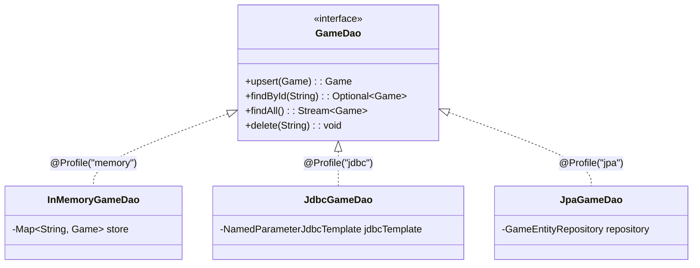

# 🎮 JavaSpring — API REST Square Games

> **Projet d'apprentissage Spring Boot 4.x & Java 21**  
> API REST de création, consultation et gestion de jeux de plateau (**Tic-Tac-Toe**, **Taquin**, **Puissance 4**), articulée autour de l'injection de dépendances Spring, de l'architecture par plugins, de l'internationalisation (i18n) et de la persistance multi-sources via le pattern DAO.

---

## 📌 Table des matières

1. [Fonctionnalités & Itérations](#-fonctionnalités--itérations)
2. [Architecture logicielle](#-architecture-logicielle)
3. [Architecture par Plugins & Moteur Externe](#-architecture-par-plugins--moteur-externe)
4. [Internationalisation (i18n)](#-internationalisation-i18n)
5. [Persistance & Pattern DAO (Itération 3)](#-persistance--pattern-dao-itération-3)
6. [Documentation des Endpoints REST](#-documentation-des-endpoints-rest)
7. [Profils Spring & Démarrage](#-profils-spring--démarrage)
8. [Tests automatisés](#-tests-automatisés)

---

## 🚀 Fonctionnalités & Itérations

- **Itération 1 — Introduction & API REST de base** :
  - Sonde de pulsation cardiaque `/heartbeat` via interface de capteur et implémentation aléatoire.
  - Endpoints REST de création et consultation de parties Tic-Tac-Toe en mémoire.
  - DTOs immuables (`record` Java 21) avec tolérance aux alias Jackson (`@JsonProperty`, `@JsonAlias`).
  - Tests d'intégration automatisés avec MockMvc.

- **Itération 2 — Architecture Plugin, Paramétrage & i18n** :
  - Découplage de la logique de jeu avec l'interface `GamePlugin`.
  - Intégration modulaire de **Tic-Tac-Toe**, **Taquin** et **Puissance 4**.
  - Paramétrage externalisé des valeurs par défaut (`@Value` et `application.properties`).
  - Internationalisation complète du catalogue de jeux via `MessageSource` et l'en-tête HTTP `Accept-Language` (`fr`, `en`, fallback).

- **Itération 3 — Persistance & Pattern DAO** :
  - Découplage complet de la couche métier (`GameServiceImpl`) via l'interface `GameDao`.
  - **DAO Mémoire (`InMemoryGameDao`)** : Cache thread-safe pour tests et usage sans SGBD.
  - **DAO JDBC (`JdbcGameDao`)** : Requêtes SQL via `NamedParameterJdbcTemplate` et initialisation par `schema.sql`.
  - **DAO JPA (`JpaGameDao`)** : Mapping relationnel Spring Data JPA avec gestion en cascade des jetons (`GameEntity`, `GameTokenEntity`, relation `@OneToMany`).
  - **Multi-sources de données** : Profils configurables pour MySQL (Docker) et H2 (in-memory).

---

## 🏛️ Architecture logicielle

Le projet respecte l'organisation par couches (**Package by Layer**) et les bonnes pratiques de conception :
- **Injection par constructeur** exclusive (champs `private final`, aucun `@Autowired` sur champ).
- **Inversion de contrôle (IoC)** reposant sur des interfaces.

```text
src/main/java/com/bsourichanh/javaspring/
│
├── JavaSpringApplication.java              <-- Point d'entrée Spring Boot (@SpringBootApplication)
│
├── config/                                 <-- Configuration Spring & Déclaration de Beans tiers
│   └── GameFactoryConfiguration.java       <-- Enregistrement des GameFactory (TicTacToe, Taquin, ConnectFour)
│
├── controller/                             <-- Couche Présentation / Contrôleurs REST
│   ├── HeartbeatController.java            <-- Endpoint de santé (/heartbeat)
│   ├── GameCatalogController.java          <-- Catalogue de jeux internationalisé (/api/catalog/games)
│   └── GameController.java                 <-- Gestion des parties (/games)
│
├── dto/                                    <-- Data Transfer Objects (Records Java 21)
│   ├── GameCreationParams.java             <-- Paramètres de création d'une partie
│   └── GameDescriptionDto.java             <-- Description traduite d'un jeu
│
├── plugin/                                 <-- Architecture Plugins de jeux
│   ├── GamePlugin.java                     <-- Contrat d'interface pour chaque type de jeu
│   ├── TicTacToePlugin.java                <-- Plugin Tic-Tac-Toe
│   ├── TaquinPlugin.java                   <-- Plugin Taquin (Puzzle 15)
│   └── ConnectFourPlugin.java              <-- Plugin Puissance 4
│
├── service/                                <-- Logique Métier
│   ├── HeartbeatSensor.java / RandomHeartbeatSensor.java
│   ├── GameCatalog.java / GameCatalogImpl.java
│   └── GameService.java / GameServiceImpl.java
│
├── dao/                                    <-- Couche d'Accès aux Données (Pattern DAO)
│   ├── GameDao.java                        <-- Interface commune de persistance
│   ├── InMemoryGameDao.java                <-- Implémentation mémoire (@Profile("memory"))
│   ├── JdbcGameDao.java                    <-- Implémentation JDBC SQL (@Profile("jdbc"))
│   ├── JpaGameDao.java                     <-- Implémentation JPA (@Profile("jpa"))
│   └── GameEntityRepository.java           <-- Spring Data JpaRepository
│
└── entity/                                 <-- Entités persistantes JPA
    ├── GameEntity.java                     <-- Table "games"
    └── GameTokenEntity.java                <-- Table "game_tokens" (relation @OneToMany)
```

---

## 🧩 Architecture par Plugins & Moteur Externe

Le moteur de jeu provient de la bibliothèque externe `fr.le_campus_numerique.square_games:engine:1.0-SNAPSHOT`.

L'interface [`GamePlugin`](file:///home/user/Documents/Cours/JavaSpring/src/main/java/com/bsourichanh/javaspring/plugin/GamePlugin.java) unifie la création de parties et les métadonnées de chaque jeu :

```java
public interface GamePlugin {
    String getFactoryId();
    String getMessageKey();
    Game createGame(Integer playerCount, Integer boardSize);
}
```

Les valeurs par défaut (nombre de joueurs, taille du plateau) sont injectées depuis `application.properties` via `@Value` dans chaque plugin :
```properties
game.tictactoe.default-player-count=2
game.tictactoe.default-board-size=3
game.taquin.default-player-count=1
game.taquin.default-board-size=4
game.connectfour.default-player-count=2
game.connectfour.default-board-size=7
```

---

## 🌍 Internationalisation (i18n)

Le catalogue des jeux fournit les libellés traduits selon l'en-tête HTTP `Accept-Language` :
- `messages_fr.properties` (Français)
- `messages_en.properties` (Anglais)
- `messages.properties` (Fichier de repli / fallback)

La configuration `spring.messages.fallback-to-system-locale=false` garantit le respect strict des préférences transmises par le client.

---

## 💾 Persistance & Pattern DAO (Itération 3)

La persistance est entièrement découplée grâce à l'interface [`GameDao`](file:///home/user/Documents/Cours/JavaSpring/src/main/java/com/bsourichanh/javaspring/dao/GameDao.java) :



### Modèle Relationnel JPA
- **`games`** : `id` (PK, UUID), `factory_id`, `board_size`, `status`, `current_player_id`, `player_ids`.
- **`game_tokens`** : `id` (PK auto-incrémentée), `game_id` (FK), `owner_id`, `name`, `removed`, `x`, `y`.

---

## 🌐 Documentation des Endpoints REST

### 1. Sonde de santé
- **URL** : `GET /heartbeat`
- **Réponse** : `200 OK` (valeur entière, ex: `73`).

---

### 2. Catalogue des jeux
- **URL** : `GET /api/catalog/games`
- **Headers** : `Accept-Language: fr` ou `Accept-Language: en`
- **Réponse (`200 OK`)** :
  ```json
  [
    { "id": "tictactoe", "name": "Morpion (Tic-Tac-Toe)" },
    { "id": "taquin", "name": "Taquin (Jeu du 15)" },
    { "id": "connectfour", "name": "Puissance 4" }
  ]
  ```

---

### 3. Création d'une partie
- **URL** : `POST /games`
- **Body (`GameCreationParams`)** :
  ```json
  {
    "gameType": "tictactoe",
    "playerCount": 2,
    "boardSize": 3
  }
  ```
  *(Les alias `type`, `nbPlayers`, `totalCell` sont supportés. Les champs omis adoptent les valeurs par défaut du plugin).*
- **Réponse (`200 OK`)** :
  ```json
  {
    "id": "707adffb-735f-4938-8ff9-078a177c40b6",
    "factoryId": "tictactoe",
    "boardSize": 3,
    "status": "ONGOING",
    "currentPlayerId": "9f5e8f30-5803-45d0-bd15-879fb30e393e",
    "playerIds": [
      "9f5e8f30-5803-45d0-bd15-879fb30e393e",
      "7ee64bfc-59e4-4118-91f0-fe1132a0594b"
    ],
    "board": {},
    "remainingTokens": [ ... ],
    "removedTokens": []
  }
  ```

---

### 4. Consultation d'une partie
- **URL** : `GET /games/{gameId}`
- **Codes de retour** :
  - `200 OK` : Partie trouvée.
  - `404 NOT FOUND` : Aucun jeu correspondant.
  - `400 BAD REQUEST` : UUID invalide.

---

## ⚙️ Profils Spring & Démarrage

Le projet supporte la combinaison modulaire des profils de stockage (**DAO**) et de source de données (**Datasource**) :

| Scénario | Profils activés | Description |
| :--- | :--- | :--- |
| **Mémoire pure (Défaut)** | `memory` | Démarrage immédiat sans base externe. |
| **JPA + MySQL (Docker)** | `jpa,mysql` | Persistance relationnelle sur MySQL Docker (port `6603`). |
| **JDBC + MySQL (Docker)** | `jdbc,mysql` | Persistance native SQL sur MySQL Docker (port `6603`). |
| **JPA + H2** | `jpa,h2` | Persistance JPA sur base H2 en mémoire vive (sans Docker). |

### Commandes de démarrage

```bash
# 1. Mode mémoire (défaut)
./mvnw spring-boot:run

# 2. Mode JPA avec MySQL Docker
./mvnw spring-boot:run -Dspring-boot.run.profiles=jpa,mysql

# 3. Mode JDBC avec MySQL Docker
./mvnw spring-boot:run -Dspring-boot.run.profiles=jdbc,mysql

# 4. Mode JPA avec base H2
./mvnw spring-boot:run -Dspring-boot.run.profiles=jpa,h2
```

### Configuration MySQL Docker
Pour exécuter avec le profil `mysql`, lancer le conteneur :
```bash
docker start docker_mysql
# Connexion directe vérifiable via :
mysql -h 127.0.0.1 -P 6603 -u root -phelloworld square_games
```

---

## 🧪 Tests automatisés

La suite de tests d'intégration dans [`JavaSpringApplicationTests`](file:///home/user/Documents/Cours/JavaSpring/src/test/java/com/bsourichanh/javaspring/JavaSpringApplicationTests.java) valide l'ensemble des cas d'usage :
- Démarrage du contexte Spring.
- Fonctionnement du `/heartbeat`.
- Catalogue de jeux avec et sans localisation i18n (`fr` et `en`).
- Création de jeux avec différents types, alias JSON et valeurs par défaut.
- Persistance et relecture par ID (`200 OK` et `404 Not Found`).

Exécuter la suite de tests :
```bash
./mvnw clean test
```
*(Résultat attendu : 12/12 tests réussis).*
